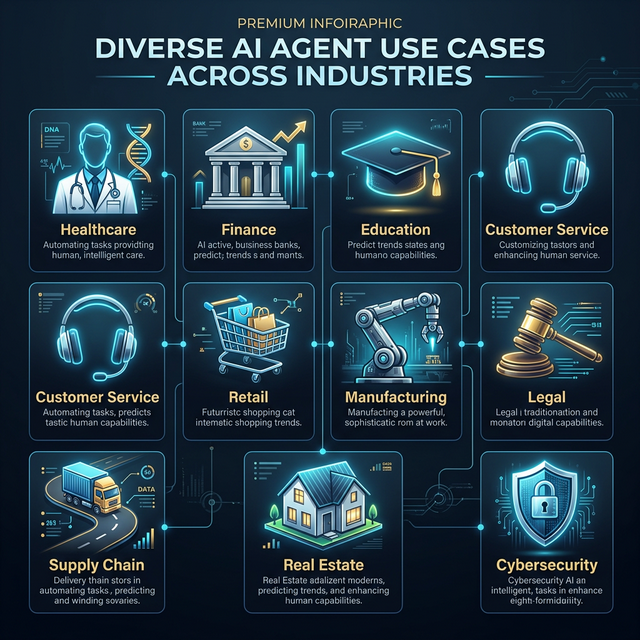

# 🤖 Global AI Agent Industry Framework



Welcome to the ultimate repository for **Industry-Specific AI Agent Blueprints**. This project provides comprehensive overviews, production-ready use cases, and standardized deployment guides for autonomous agents across the world's most critical sectors.

---

## 🏗️ Project Architecture

This repository is organized into distinct **Business Verticals**. Each vertical contains:
- **`OVERVIEW.md`**: High-level value proposition and system architecture.
- **`USE_CASES.md`**: Detailed technical breakdown of 3+ "Hero" use cases.
- **`DEPLOYMENT_GUIDE.md`**: Step-by-step instructions for productionizing agents (Docker, Cloud, Security).

```bash
industries/
├── 🏥 healthcare/       # Medical Diagnostics & Clinical Support
├── 💰 finance/          # Algorithmic Trading & Fraud Prevention
├── 🛡️ cybersecurity/    # Autonomous SOC & Threat Hunting
├── 🎓 education/        # Adaptive Learning & Socratic Tutors
├── 🏠 real_estate/      # Property Valuation & Lead Nurturing
├── 🛒 retail/           # Personal Stylists & Dynamic Pricing
├── ☎️ customer_service/ # Technical Support & Billing Bots
├── 🏭 manufacturing/    # Predictive Maintenance & Safety Vision
├── ⚖️ legal/            # Contract Review & Discovery Navigators
└── 🚚 supply_chain/     # Logistics Optimization & Negotiation
```

---

## 🌟 Strategic Vision

Our goal is to bridge the gap between "Cool AI Demos" and **"Institutional-Grade Agentic Systems"**. We focus on:
- **Scalability**: Deploying via Kubernetes and Serverless architectures.
- **Security**: HIPAA, SOC2, and GDPR-compliant deployment strategies.
- **Reliability**: Using frameworks like **LangGraph** and **CrewAI** for deterministic agent behavior.

---

## 🚀 Getting Started

1.  **Choose your industry** from the list above.
2.  Review the **Architecture Diagrams** to understand the data flow.
3.  Follow the **Deployment Guide** to launch your first agent in a sandbox or production environment.

---

## 🛠️ Recommended Tech Stack

| Component | Standard Choice | Advanced Choice |
| :--- | :--- | :--- |
| **Orchestration** | LangChain / Agno | LangGraph / Autogen |
| **Brain** | Gemini 2.0 Pro / GPT-4o | Claude 3.5 Sonnet |
| **Memory (Vector)** | Pinecone / Qdrant | ChromaDB (Local) |
| **Deployment** | Docker / Streamlit | Kubernetes / FastAPI |

---

## 🤝 Contributing

We welcome contributions! Please refer to our [CONTRIBUTING.md](./CONTRIBUTING.md) to add new industry use cases or improve existing deployment guides.

---
*Created with ❤️ for the Global AI Architecture Community*
