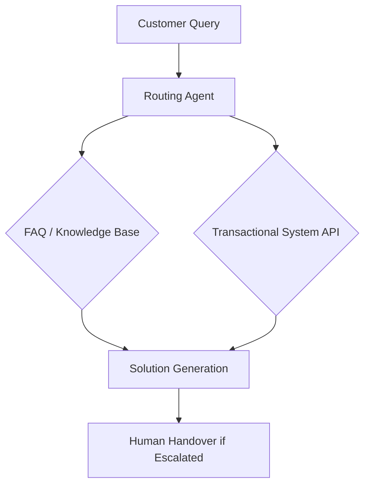

# ☎️ Customer Service AI Agents Overview

Customer Service agents are evolving from simple "if-else" chatbots to complex problem-solvers that can handle technical issues, billing disputes, and emotional escalation.

## 🌟 Core Value Proposition
- **24/7 Availability**: Instant response regardless of time zone.
- **Complexity Handling**: Agents that can navigate internal systems to solve real problems.
- **Consistent Tone**: Ensuring brand-aligned communication in every interaction.

---

## 🏗️ Architecture for CS Agents

## 📂 Featured Use Cases
- [Technical Troubleshooting Agent](./USE_CASES.md#1-technical-support-specialist)
- [Billing & Subscription Bot](./USE_CASES.md#2-billing--retention-agent)

## 🚀 Getting Started
Check the [Deployment Guide](./DEPLOYMENT_GUIDE.md) to scale your support.
