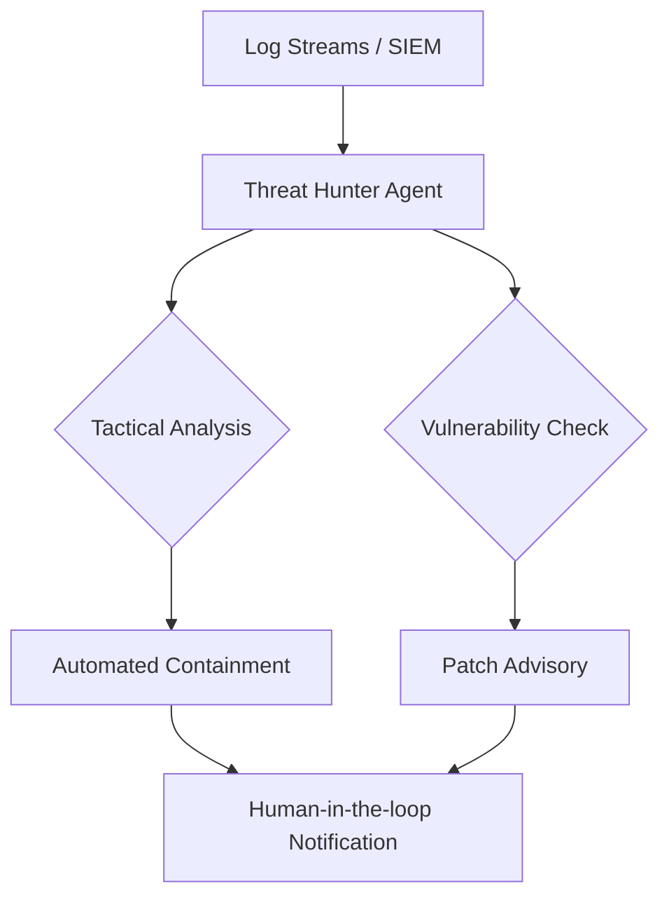

# 🛡️ Cybersecurity AI Agents Overview

Cybersecurity agents act as autonomous SOC (Security Operations Center) analysts, hunting for threats and responding to incidents at machine speed.

## 🌟 Core Value Proposition
- **Machine-Speed Response**: Neutralizing threats in milliseconds, not hours.
- **Continuous Monitoring**: 24/7 scanning of network logs and vulnerability databases.
- **Predictive Defense**: Identifying patterns that suggest a breach before it happens.

---

## 🏗️ Architecture for Security Agents

## 📂 Featured Use Cases
- [Autonomous Red-Team Agent](./USE_CASES.md#1-autonomous-red-team-agent)
- [Phishing Analysis Assistant](./USE_CASES.md#2-phishing-analyst)

## 🚀 Getting Started
Check the [Deployment Guide](./DEPLOYMENT_GUIDE.md) to secure your infrastructure.
