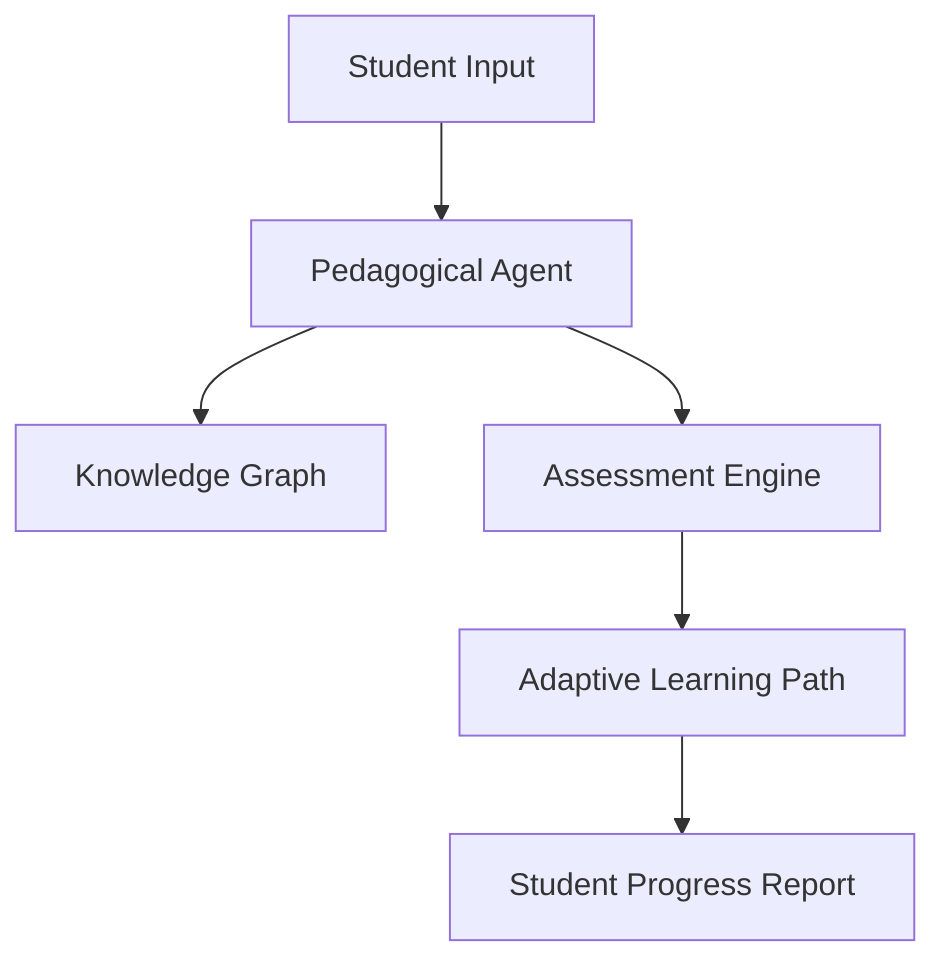

# 🎓 Education AI Agents Overview

Education AI Agents are transforming learning from a one-size-fits-all model to a hyper-personalized, 24/7 interactive experience.

## 🌟 Core Value Proposition
- **Personalization**: Content adapted to the student's pace and learning style.
- **Scalability**: One agent can support thousands of students simultaneously.
- **Engagement**: Interactive simulations and instant feedback loops.

---

## 🏗️ Architecture for Education Agents

## 📂 Featured Use Cases
- [Interactive AI Tutor](./USE_CASES.md#1-interactive-ai-tutor)
- [Automated Grading Assistant](./USE_CASES.md#2-automated-grading-assistant)

## 🚀 Getting Started
Check the [Deployment Guide](./DEPLOYMENT_GUIDE.md) to launch an Education Agent.
