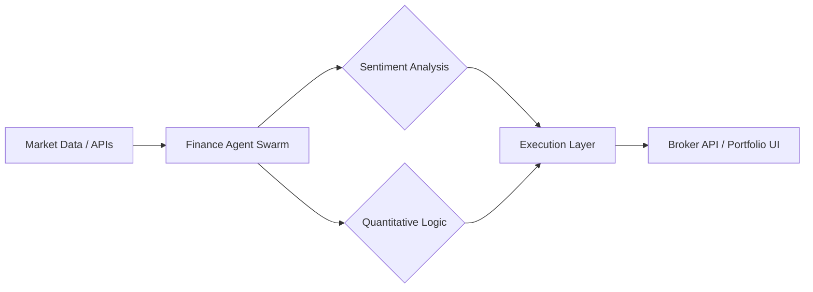

# 💰 Finance AI Agents Overview

Financial AI Agents automate high-stakes decision-making, from micro-trading to enterprise risk management.

## 🌟 Core Value Proposition
- **Speed**: Execution of trades and sentiment analysis in milliseconds.
- **Risk Mitigation**: Continuous monitoring for fraud and market shifts.
- **Deep Insights**: Parsing thousands of earnings call transcripts instantly.

---

## 🏗️ Architecture for Finance Agents

## 📂 Featured Use Cases
- [Equity Research Analyst Agent](./USE_CASES.md#1-equity-research-analyst)
- [Real-time Fraud Detection](./USE_CASES.md#2-fraud-investigation-agent)

## 🚀 Getting Started
Check the [Deployment Guide](./DEPLOYMENT_GUIDE.md) to launch a Financial Intelligence Swarm.
