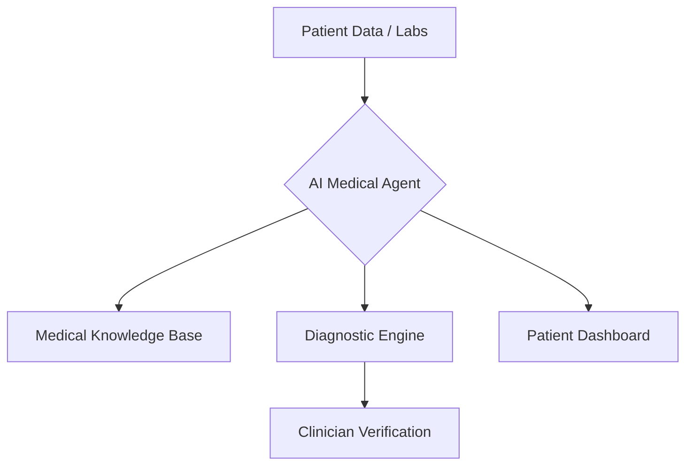

# 🏥 Healthcare AI Agents Overview

AI Agents in healthcare are designed to reduce administrative burden on clinicians, enhance patient diagnostics, and provide 24/7 support.

## 🌟 Core Value Proposition
- **Accuracy**: LLM-driven medical history parsing.
- **Efficiency**: Reduction in manual report analysis by 60%.
- **Accessibility**: Instant health insights for patients.

---

## 🏗️ Architecture for Healthcare Agents

## 📂 Featured Use Cases
- [Medical Report Analyzer](./USE_CASES.md#1-medical-report-analyzer)
- [Remote Patient Monitoring](./USE_CASES.md#2-remote-monitoring-agent)

## 🚀 Getting Started
Check the [Deployment Guide](./DEPLOYMENT_GUIDE.md) to launch a Healthcare Agent in under 10 minutes.
