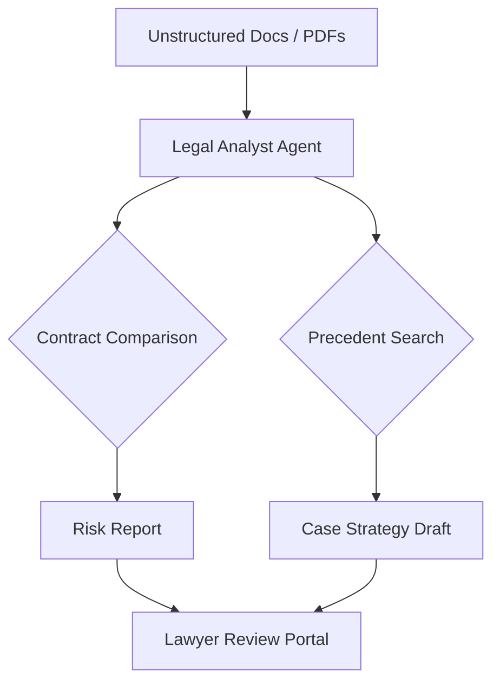

# ⚖️ Legal AI Agents Overview

Legal agents are revolutionizing the industry by automating document review, case research, and contract management, allowing lawyers to focus on strategy and advocacy.

## 🌟 Core Value Proposition
- **Precision**: LLMs can find "needles in haystacks" across thousands of pages of discovery.
- **Speed**: Reviewing a 50-page contract for "Red Flags" takes seconds, not hours.
- **Consistency**: Removing human fatigue from repetitive document review.

---

## 🏗️ Architecture for Legal Agents

## 📂 Featured Use Cases
- [Automated Contract Reviewer](./USE_CASES.md#1-contract-red-flag-agent)
- [Litigation Discovery Assistant](./USE_CASES.md#2-discovery-navigator)

## 🚀 Getting Started
Check the [Deployment Guide](./DEPLOYMENT_GUIDE.md) to modernize your practice.
