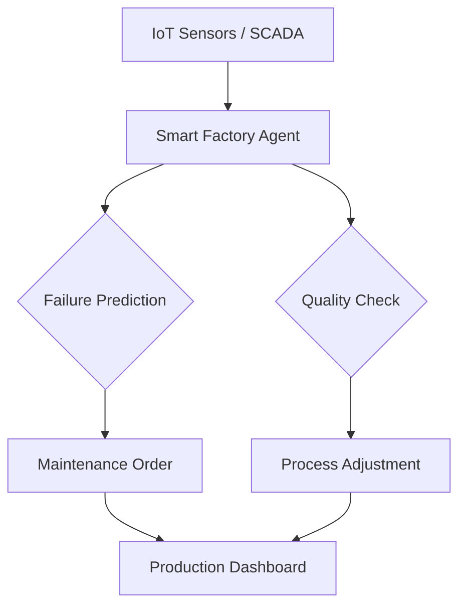

# 🏭 Manufacturing AI Agents Overview

Manufacturing agents drive the "Smart Factory" by predicting equipment failures, optimizing production schedules, and ensuring supply-chain resilience.

## 🌟 Core Value Proposition
- **Predictive Maintenance**: Reducing downtime by identifying signs of wear before failure.
- **Yield Optimization**: Adjusting process parameters in real-time to maximize output quality.
- **Safety Monitoring**: Autonomous scanning for OSHA compliance and worker safety hazards.

---

## 🏗️ Architecture for Manufacturing Agents

## 📂 Featured Use Cases
- [Predictive Maintenance Agent](./USE_CASES.md#1-predictive-maintenance-specialist)
- [Supply Chain Synchronization Agent](./USE_CASES.md#2-supply-chain-orchestrator)

## 🚀 Getting Started
Check the [Deployment Guide](./DEPLOYMENT_GUIDE.md) to modernize your factory floor.
