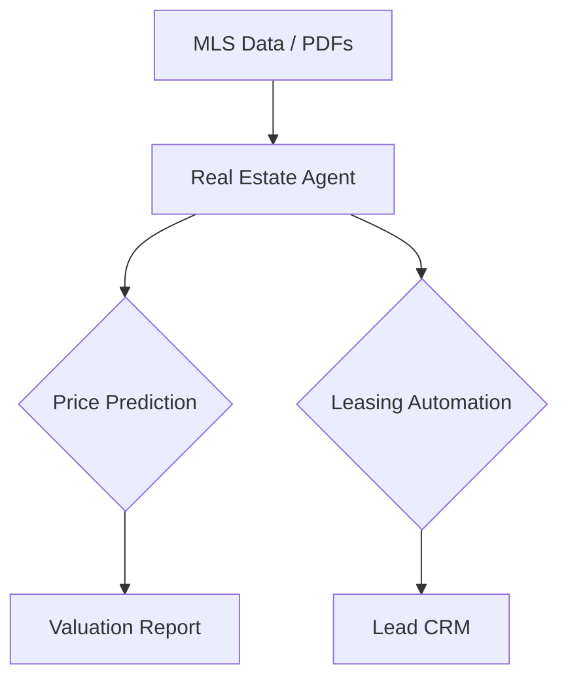

# 🏠 Real Estate AI Agents Overview

Real estate agents automate property valuations, market trend scanning, and lead management.

## 🌟 Core Value Proposition
- **Valuation**: Precise pricing using multi-source data (Zillow, Redfin, Local MLS).
- **Personalization**: Matching buyers to homes using behavioral analysis.
- **Automation**: 24/7 Virtual Assistant for scheduling tours and answering property FAQs.

---

## 🏗️ Architecture for Real Estate Agents

## 📂 Featured Use Cases
- [AI Property Valuation Agent](./USE_CASES.md#1-property-valuation-agent)
- [Real Estate Lead Nurturer](./USE_CASES.md#2-lead-nurturer-agent)

## 🚀 Getting Started
Check the [Deployment Guide](./DEPLOYMENT_GUIDE.md) to launch a Real Estate Agent.
