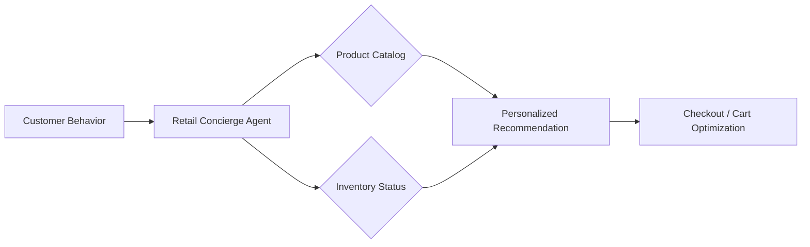

# 🛒 Retail AI Agents Overview

Retail AI Agents optimize the entire customer journey, from inventory management to ultra-personalized shopping experiences.

## 🌟 Core Value Proposition
- **Ultra-Personalization**: Agents that understand style and preference better than cookies.
- **Inventory Optimization**: Predicting stockouts and overstocks with high precision.
- **Support-to-Sales**: Converting support queries into upsell opportunities.

---

## 🏗️ Architecture for Retail Agents

## 📂 Featured Use Cases
- [Visual Search & Recommender](./USE_CASES.md#1-visual-shopping-agent)
- [Dynamic Pricing Agent](./USE_CASES.md#2-dynamic-pricing-engine)

## 🚀 Getting Started
Check the [Deployment Guide](./DEPLOYMENT_GUIDE.md) to revolutionize your storefront.
