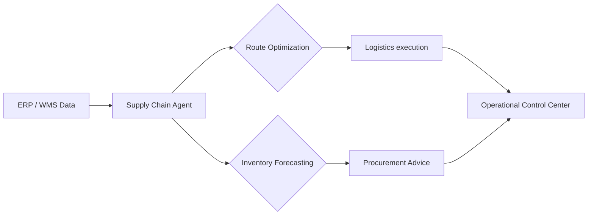

# 🚚 Supply Chain AI Agents Overview

Supply chain agents provide end-to-end visibility and autonomous decision-making in a world of constant logistical disruption.

## 🌟 Core Value Proposition
- **Resilience**: Autonomously finding alternatives when a port is blocked or a supplier fails.
- **Inventory Precision**: Reducing "Bullwhip Effect" by syncing real-time demand with production.
- **Sustainability**: Optimizing routes to minimize carbon footprint while meeting deadlines.

---

## 🏗️ Architecture for Supply Chain Agents

## 📂 Featured Use Cases
- [Logistics Optimization Agent](./USE_CASES.md#1-logistics-optimizer)
- [Procurement Negotiation Bot](./USE_CASES.md#2-negotiation-agent)

## 🚀 Getting Started
Check the [Deployment Guide](./DEPLOYMENT_GUIDE.md) to streamline your operations.
